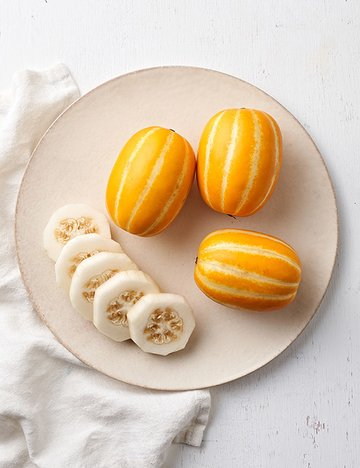

# 뷰 프로젝트 작업 순서
- 프로젝트 폴더 생성
- vscode 실행
- 프로젝트 폴더 열기
- index.html 웹 파일 생성
- ! + tab HTML 자동 완성
- 웹방식 CDN MDN에서 복붙
- 뷰 템플릿 태크 생성
- 뷰 인스턴스 생성
- 뷰 스타일 생성


# 배포폴더
- (Windows 폴더) D:\shlee\1강\0315_01_뷰시작하기
- (FTP 폴더) /html
    - index.html
    - img

# 공유폴더
- 내PC 192.168.136.163
- 강사PC 192.168.136.150
- 접속방법 \\192.168.136.150


# 최종 배포파일
> http://shlee1990.dothome.co.kr/index.html
> http://shlee1990.dothome.co.kr/20250315_01_index.html

# SSL 웹보안 신청
> https://shlee1990.dothome.co.kr/index.html

# 웹방식 CDN
``` html
<script src="https://cdn.jsdelivr.net/npm/vue/dist/vue.js"></script>
```

``` html
<!-- 뷰 템플릿 HTML -->
<div id="app2">
    <!-- <h1 title="뷰 시작하기">제목: {{ title }}</h1> -->
    <!-- <h2 title="이상호">이름: {{ name }}</h2> -->
    <h1 v-bind:title="title">제목: {{ title }}</h1>
    <h2 :title="name">이름: {{ name }}</h2>
    <p>
        <!--  -->
        
        
    </p>
</div>
```

``` html
<!-- 뷰 컨트롤러 자바스크립트 -->
<script>
    // 뷰 사용 선언 => 뷰 프로그램이 상단에 설치 되어야 한다.
    new Vue({
        el: '#app2',
        data() {
            return {
                title: '뷰2 시작하기',
                name: '이상호',
                image: {
                    src :'./img/1653038449592l0.jpeg',
                    alt : '[풀스키친] 라구 볼로네제 파스타 - 넓적한 면과 진한 라구 소스가 어우러진 파스타',
                },
            };
        },

            // 필요한 경우, methods, computed, watch, 라이프사이클 훅 등을 여기에 추가
    });
</script>
```
``` html
<!-- 뷰 UI 스타일 -->
<style>
    #app2 {
        padding: 10px;
        text-align: center;
    }

    #app2 h1 {
        font-size: 5rem;
        color: #c33;
        padding-top: 2rem;
    }
    #app2 h2 {
        font-size: 3rem;
        color: #666;
        padding-top: 2rem;
    }

</style>
```
